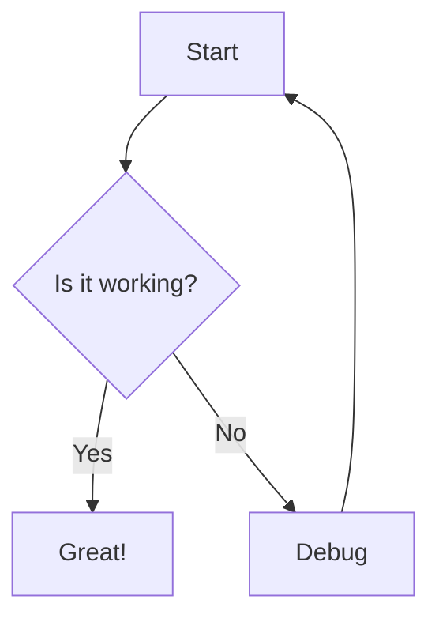

## How Explicode works

Use Markdown syntax inside multiline comments:

- ### Python: Docstring triple-quotes
    Explicode looks for triple-quoted strings (`"""` or `'''`) that start at the beginning of a line (nothing precedes them but whitespace). Triple-quotes used mid-expression as string values are ignored.  

    ```python
    """
    This is a Markdown doc block
    """

    x = """this is NOT a doc block"""

    # Single-line comments are NOT rendered as Markdown, they stay as code.
    ```
- ### C-family languages: Block comments
    Explicode renders any `/* ... */` block comment that starts at the beginning of a line as Markdown. JSDoc-style `/** ... */` comments are also supported.

    ```javascript
    /*
    This is a Markdown doc block.
    */

    /** This is valid too, leading asterisks are stripped automatically. */

    // Single-line comments are NOT rendered as Markdown, they stay as code.
    ```

Everything outside a doc block renders as a syntax-highlighted code block.

## Supported Languages

Python · JavaScript / TypeScript · JSX / TSX · Java · C / C++ / C# · CUDA · Go · Rust · PHP · Swift · Kotlin · Scala · Dart · Objective-C · SQL · Markdown · Plain text

## Syntax Support

Full [Markdown](https://www.markdownguide.org/basic-syntax/) syntax is supported, including headings, lists, tables, links, images, and more (plus math and diagrams, detailed below). Use two trailing spaces at the end of a line to force a line break.

### Media

Supported file types: `png`, `jpg`, `jpeg`, `gif`, `svg`, `webp`. Use external URLs or relative paths (relative paths resolve from the current file's location).

```markdown


```

### Links

Repository files can be interlinked using relative paths. External URLs open in a new browser tab. To link to a specific heading, use `#` followed by the heading title in lowercase, spaces replaced with hyphens, and special characters removed.

```markdown
[Same folder](app.py)
[Subfolder](src/app.py)
[Parent folder](../README.md)
[External](https://explicode.com)
[Link to heading](./src/app.py#how-to-test-code)
[Same page heading](#how-to-test-code)
```

### Math (KaTeX)

Inline math uses single dollar signs, block math uses double dollar signs or a fenced code block with the `math` language tag.

```latex
Inline: $E = mc^2$

Block:
$$
\frac{d}{dx}\left(\int_{a}^{x} f(t)\,dt\right) = f(x)
$$
```

### Diagrams (Mermaid)

Use a fenced code block with the `mermaid` language tag to render diagrams.

~~~markdown

~~~

## Examples

#### Original script

```python
"""
# Fibonacci Sequence

Generates the first `n` Fibonacci numbers iteratively.
- **Input**: `n` (int) — how many numbers to generate
- **Output**: list of the first `n` Fibonacci numbers
"""
def fibonacci(n):
    if n <= 0:
        return []
    elif n == 1:
        return [0]
    seq = [0, 1]
    for _ in range(2, n):
        seq.append(seq[-1] + seq[-2])
    return seq

fibonacci(5)  # [0, 1, 1, 2, 3]
```
#### Markdown conversion

~~~markdown
# Fibonacci Sequence

Generates the first `n` Fibonacci numbers iteratively.
- **Input**: `n` (int) — how many numbers to generate
- **Output**: list of the first `n` Fibonacci numbers

```python
def fibonacci(n):
    if n <= 0:
        return []
    elif n == 1:
        return [0]
    seq = [0, 1]
    for _ in range(2, n):
        seq.append(seq[-1] + seq[-2])
    return seq

fibonacci(5)  # [0, 1, 1, 2, 3]
```
~~~

Find more real examples in the `/examples` folder.
