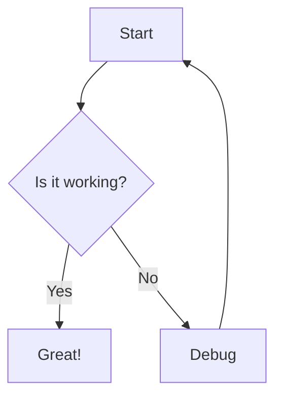

# Explicode

> **Explicode** lets you write rich **Markdown** documentation directly inside your code comments, turning a single source file into both **runnable code and clean documentation**.

Because the documentation lives **inside comments**, it doesn't affect your program, runtime, or build process — **no special tooling required**. Explicode works across **many programming languages**, allowing teams to adopt it without changing their existing workflows or project structure. Documentation stays **close to the code it describes**, making it easier to keep information accurate as the codebase evolves. Since both code and documentation live in the same file, updates happen together and are automatically **versioned in Git**, reducing the risk of stale or forgotten documentation.

Open a **live preview in VSCode** to see beautifully rendered documentation side-by-side with your code while you write. When you're ready to share your work, **export to Markdown or HTML** for publishing, collaboration, or integration with existing documentation sites.


## Coding Agents

Explicode keeps **code and docs tightly coupled**, providing **high-quality context** that helps agents understand **what the code does and why** without jumping between files. Teach your AI to write code with documentation using this [skill](./skills/explicode/SKILL.md).


## How It Works

Use Markdown syntax inside the multiline comments of your favorite language:

- ### Python — Docstring triple-quotes

    Explicode looks for triple-quoted strings (`"""` or `'''`) that start at the **beginning of a line** (only whitespace before them). These are the same positions Python uses for docstrings — at the top of a module, class, or function. Triple-quotes used as regular string values mid-expression are ignored.

````python
    """
    This is a Markdown doc block — triple-quote is at the start of the line.
    """

    x = """this is NOT a doc block — it's a string value assigned to a variable"""
````

- ### C-family languages — Block comments

    For all other supported languages, Explicode renders any `/* ... */` block comment as Markdown. JSDoc-style `/** ... */` comments are also supported.

````javascript
    /*
    This is a Markdown doc block.
    */

    /** This too — leading asterisks are stripped automatically. */

    // Single-line comments are NOT rendered as Markdown, they stay as code.
````

Everything outside a doc block is rendered as a syntax-highlighted code block. Full [CommonMark](https://www.markdownguide.org/basic-syntax/) syntax is supported, including headings, lists, math, images, tables, diagrams, and more.


## Quick Start

Open any supported file in VSCode, then either:

- Press `Ctrl+Alt+E` (or `Cmd+Alt+E` on Mac)
- Right-click in the editor and select **Open with Explicode**
- Find the Explicode icon in your sidebar


This opens a live preview panel in the sidebar that updates as you edit. We recommend moving the extension to the second sidebar.

The ⚙️ button in the header provides additional options:
- Toggle Dark/Light theme
- Open the guide
- Export the render as `.md` or `.html`


## Additional Features

### Media

Supported file types: `png`, `jpg`, `jpeg`, `gif`, `svg`, `webp`. Use external URLs or relative paths — relative paths resolve from the current file's location.

````markdown


````

### Links

Repository files can be interlinked using relative paths. External URLs open in a new browser tab.

````markdown
[Same folder](app.py)
[Subfolder](src/app.py)
[Parent folder](../README.md)
[External](https://explicode.com)
````

To link to a specific heading in another file, use `#` followed by the heading title in lowercase with spaces replaced by hyphens and special characters removed.

````markdown
[Link to heading](./src/app.py#how-to-test-code)
[Same page heading](#how-to-test-code)
````

### Math (KaTeX)

Inline math uses single dollar signs, block math uses double dollar signs or a fenced code block with the `math` language tag.

````markdown
Inline: $E = mc^2$

Block:
$$
\frac{d}{dx}\left(\int_{a}^{x} f(t)\,dt\right) = f(x)
$$

or

```math
\frac{d}{dx}\left(\int_{a}^{x} f(t)\,dt\right) = f(x)
```
````

### Diagrams (Mermaid)

Use a fenced code block with the `mermaid` language tag to render diagrams.

````markdown

````


## Examples

#### Python

````python
"""
# Fibonacci Sequence

Generates the first `n` Fibonacci numbers iteratively.

- **Input**: `n` (int) — how many numbers to generate
- **Output**: list of the first `n` Fibonacci numbers
"""

def fibonacci(n):
    if n <= 0:
        return []
    elif n == 1:
        return [0]
    seq = [0, 1]
    for _ in range(2, n):
        seq.append(seq[-1] + seq[-2])
    return seq

fibonacci(5)  # [0, 1, 1, 2, 3]
````

#### JavaScript

````javascript
/*
# Fibonacci Sequence

Generates the first `n` Fibonacci numbers iteratively.

- **Input**: `n` (int) — how many numbers to generate
- **Output**: list of the first `n` Fibonacci numbers
*/

function fibonacci(n) {
    if (n <= 0) return [];
    if (n === 1) return [0];
    const seq = [0, 1];
    for (let i = 2; i < n; i++) {
        seq.push(seq[i - 1] + seq[i - 2]);
    }
    return seq;
}

fibonacci(5);  // [0, 1, 1, 2, 3]
````

## Supported Languages

- Python
- JavaScript / TypeScript
- JSX / TSX
- Java
- C / C++ / C#
- CUDA
- Go
- Rust
- PHP
- Swift
- Kotlin
- Scala
- Dart
- Objective-C
- SQL
- Markdown
- Plain text

Need support for another language? Open an issue or reach out.


## Contact

Contact us [here](https://explicode.com/contact) with bug reports, feature requests, or collaboration inquiries.