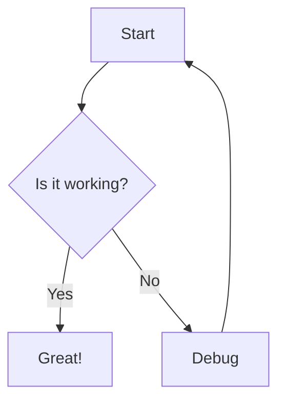

# Explicode

> **Explicode** lets you write rich **Markdown** documentation directly inside your code comments, turning a single source file into both **runnable code and clean documentation**.

Explicode is inspired by **literate programming**, first introduced by **Donald Knuth**, which argues that code should be written for both humans and computers, and now, increasingly, for agents as well. Explicode is a modern take on this idea, focusing on simplicity, readability, and flexibility.

[](LICENSE)

[](https://marketplace.visualstudio.com/items?itemName=Explicode.explicode)

## Why Explicode?

- 📝 **Docs live in code comments**, no separate files to maintain.
- 🎨 **Rich Markdown formatting**: syntax highlighting, LaTeX, images, Mermaid, interlinking.
- 🌍 **15+ programming languages supported**, no workflow changes needed.
- 👀 **Live preview in VS Code**, side-by-side.
- ⚡ **No configurations or complex tooling required**, just simple comment conventions.
- 🔄 **Less likely to go stale** since docs sit right next to the code.
- 🤖 **Better AI context**, docs and code in one file.
- 🌿 **Versioned with Git** automatically.
- 📄 **Export to Markdown or HTML** for sharing.

## Demo


A quick walkthrough of the Explicode VS Code extension: open a source file with inline documentation and see it instantly rendered into a clean, notebook-style view alongside your code.

## Quick Start

Open any supported file in VS Code, then either:
- Press `Ctrl+Alt+E` (or `Cmd+Alt+E` on Mac)
- Right-click in the editor and select **Open with Explicode**
- Click the Explicode icon in your sidebar

This opens a live preview panel that updates as you edit. We recommend moving the extension to the second sidebar.

The ⚙️ button in the header provides additional options:
- Toggle Dark/Light theme
- Open the guide
- Export the render as `.md` or `.html`

## Supported Languages

Python · JavaScript / TypeScript · JSX / TSX · Java · C / C++ / C# · CUDA · Go · Rust · PHP · Swift · Kotlin · Scala · Dart · Objective-C · SQL · Markdown · Plain text

Want to add a language? See [CONTRIBUTING.md](CONTRIBUTING.md).

## Coding Agents

Explicode keeps **code and docs tightly coupled**, giving agents **high-quality context** to understand **what the code does and why** without jumping between files. Teach your AI to write code with embedded documentation: copy [`SKILL.md`](./skills/explicode/SKILL.md) into `.claude/skills/explicode/` for Claude or `.cursor/skills/explicode/` for Cursor in your project root.

## How It Works
Use Markdown syntax inside multiline comments:

- ### Python — Docstring triple-quotes
    Explicode looks for triple-quoted strings (`"""` or `'''`) that open a line — nothing precedes them but whitespace. Triple-quotes used mid-expression as string values are ignored.  

    ```python
    """
    This is a Markdown doc block
    """

    x = """this is NOT a doc block"""

    # Single-line comments are NOT rendered as Markdown, they stay as code.
    ```
- ### C-family languages — Block comments
    Explicode renders any `/* ... */` block comment as Markdown. JSDoc-style `/** ... */` comments are also supported.
    ```javascript
    /*
    This is a Markdown doc block.
    */

    /** This is valid too, leading asterisks are stripped automatically. */

    // Single-line comments are NOT rendered as Markdown, they stay as code.
    ```

Everything outside a doc block renders as a syntax-highlighted code block.

## Syntax Support

### Text

Full [Markdown](https://www.markdownguide.org/basic-syntax/) syntax is supported, including headings, lists, tables, images, and more (plus math and diagrams, detailed below). Use two trailing spaces at the end of a line to force a line break.

### Media

Supported file types: `png`, `jpg`, `jpeg`, `gif`, `svg`, `webp`. Use external URLs or relative paths — relative paths resolve from the current file's location.

````markdown


````

### Links

Repository files can be interlinked using relative paths. External URLs open in a new browser tab.

````markdown
[Same folder](app.py)
[Subfolder](src/app.py)
[Parent folder](../README.md)
[External](https://explicode.com)
````

To link to a specific heading in another file, use `#` followed by the heading title in lowercase with spaces replaced by hyphens and special characters removed.

````markdown
[Link to heading](./src/app.py#how-to-test-code)
[Same page heading](#how-to-test-code)
````

### Math (KaTeX)

Inline math uses single dollar signs, block math uses double dollar signs or a fenced code block with the `math` language tag.

````markdown
Inline: $E = mc^2$

Block:
$$
\frac{d}{dx}\left(\int_{a}^{x} f(t)\,dt\right) = f(x)
$$

or

```math
\frac{d}{dx}\left(\int_{a}^{x} f(t)\,dt\right) = f(x)
```
````

### Diagrams (Mermaid)

Use a fenced code block with the `mermaid` language tag to render diagrams.

````markdown

````

## Examples
#### Python
```python
"""
# Fibonacci Sequence

Generates the first `n` Fibonacci numbers iteratively.
- **Input**: `n` (int) — how many numbers to generate
- **Output**: list of the first `n` Fibonacci numbers
"""
def fibonacci(n):
    if n <= 0:
        return []
    elif n == 1:
        return [0]
    seq = [0, 1]
    for _ in range(2, n):
        seq.append(seq[-1] + seq[-2])
    return seq

fibonacci(5)  # [0, 1, 1, 2, 3]
```

#### JavaScript
```javascript
/*
# Fibonacci Sequence

Generates the first `n` Fibonacci numbers iteratively.
- **Input**: `n` (int) — how many numbers to generate
- **Output**: list of the first `n` Fibonacci numbers
*/
function fibonacci(n) {
  if (n <= 0) return [];
  if (n === 1) return [0];
  const seq = [0, 1];
  for (let i = 2; i < n; i++) {
    seq.push(seq[i - 1] + seq[i - 2]);
  }
  return seq;
}

fibonacci(5);  // [0, 1, 1, 2, 3]
```

See a complete working example in [`example.py`](./example.py).

## Contact
Have a bug report, feature request, or collaboration inquiry? Reach out [here](https://explicode.com/contact).

## License
Explicode is licensed under the [MIT License](LICENSE) — free to use, modify, and distribute for personal and commercial projects.

## Contributing
Contributions are always welcome! See [CONTRIBUTING.md](CONTRIBUTING.md) for guidelines, then open an issue or submit a pull request.

## Privacy
Explicode is privacy-friendly: **we do not collect or store your code or personal data**. Everything stays local unless you choose to share or publish it yourself.