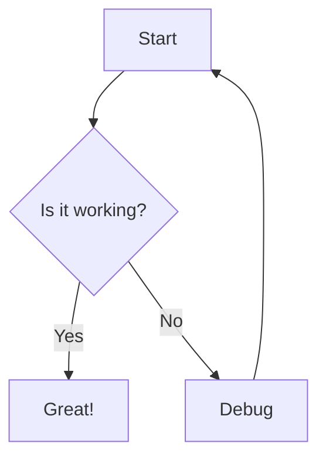

# Explicode

> **Explicode** lets you write rich **Markdown** documentation directly inside your code comments, turning a single source file into both **runnable code and clean documentation**.

Explicode is inspired by **literate programming**, first introduced by **Donald Knuth**, which argues that code should be written for humans as well as computers, and now, increasingly, for agents as well. Explicode is a modern take on this idea, focusing on simplicity, readability, and flexibility.

[](LICENSE)
[](https://github.com/YOUR_GITHUB_USER/YOUR_REPO)
[](https://marketplace.visualstudio.com/items?itemName=Explicode.explicode)

## Why Explicode?

- 📝 **Documentation lives inside your code comments**, keeping files fully executable with no separate documentation files to maintain.
- 🎨 **Rich documentation support** with Markdown, syntax-highlighted code blocks, LaTeX math, images, Mermaid diagrams, and interlinked files.
- ⚡ **No special tooling or build process**, just follow simple comment conventions and you're ready to go.
- 🔄 **Documentation stays close to the code** it describes, making it much less likely to become outdated.
- 🌍 **Works across 15+ programming languages** without requiring changes to your existing workflow.
- 🤖 **Better context for AI coding agents** by keeping documentation and implementation together in the same file.
- 🌿 **Automatically versioned with Git** since documentation lives alongside your source code.
- 👀 **Live preview in VS Code** with beautifully rendered documentation displayed side-by-side as you write.
- 📄 **Export to Markdown or HTML** for publishing, sharing, or collaborating with others.

## Demo


Watch a quick walkthrough of Explicode in action. The demo shows how to open a source file containing inline documentation on the extension, and see it instantly rendered into a clean, notebook-style view alongside your code.

## How It Works

Use Markdown syntax inside the multiline comments of your favorite language:

- ### Python — Docstring triple-quotes

    Explicode looks for triple-quoted strings (`"""` or `'''`) that start at the **beginning of a line** (only whitespace before them). These are the same positions Python uses for docstrings — at the top of a module, class, or function. Triple-quotes used as regular string values mid-expression are ignored.

````python
    """
    This is a Markdown doc block — triple-quote is at the start of the line.
    """

    x = """this is NOT a doc block — it's a string value assigned to a variable"""
````

- ### C-family languages — Block comments

    For all other supported languages, Explicode renders any `/* ... */` block comment as Markdown. JSDoc-style `/** ... */` comments are also supported.

````javascript
    /*
    This is a Markdown doc block.
    */

    /** This too — leading asterisks are stripped automatically. */

    // Single-line comments are NOT rendered as Markdown, they stay as code.
````

Everything outside a doc block is rendered as a syntax-highlighted code block. Full [CommonMark](https://www.markdownguide.org/basic-syntax/) syntax is supported, including headings, lists, math, images, tables, diagrams, and more.


## Quick Start

Open any supported file in VSCode, then either:

- Press `Ctrl+Alt+E` (or `Cmd+Alt+E` on Mac)
- Right-click in the editor and select **Open with Explicode**
- Find the Explicode icon in your sidebar


This opens a live preview panel in the sidebar that updates as you edit. We recommend moving the extension to the second sidebar.

The ⚙️ button in the header provides additional options:
- Toggle Dark/Light theme
- Open the guide
- Export the render as `.md` or `.html`

## Coding Agents

Explicode keeps **code and docs tightly coupled**, providing **high-quality context** that helps agents understand **what the code does and why** without jumping between files. Teach your AI to write code with documentation using this [skill](./skills/explicode/SKILL.md).


## Additional Features

### Media

Supported file types: `png`, `jpg`, `jpeg`, `gif`, `svg`, `webp`. Use external URLs or relative paths — relative paths resolve from the current file's location.

````markdown


````

### Links

Repository files can be interlinked using relative paths. External URLs open in a new browser tab.

````markdown
[Same folder](app.py)
[Subfolder](src/app.py)
[Parent folder](../README.md)
[External](https://explicode.com)
````

To link to a specific heading in another file, use `#` followed by the heading title in lowercase with spaces replaced by hyphens and special characters removed.

````markdown
[Link to heading](./src/app.py#how-to-test-code)
[Same page heading](#how-to-test-code)
````

### Math (KaTeX)

Inline math uses single dollar signs, block math uses double dollar signs or a fenced code block with the `math` language tag.

````markdown
Inline: $E = mc^2$

Block:
$$
\frac{d}{dx}\left(\int_{a}^{x} f(t)\,dt\right) = f(x)
$$

or

```math
\frac{d}{dx}\left(\int_{a}^{x} f(t)\,dt\right) = f(x)
```
````

### Diagrams (Mermaid)

Use a fenced code block with the `mermaid` language tag to render diagrams.

````markdown

````


## Examples

#### Python

````python
"""
# Fibonacci Sequence

Generates the first `n` Fibonacci numbers iteratively.

- **Input**: `n` (int) — how many numbers to generate
- **Output**: list of the first `n` Fibonacci numbers
"""

def fibonacci(n):
    if n <= 0:
        return []
    elif n == 1:
        return [0]
    seq = [0, 1]
    for _ in range(2, n):
        seq.append(seq[-1] + seq[-2])
    return seq

fibonacci(5)  # [0, 1, 1, 2, 3]
````

#### JavaScript

````javascript
/*
# Fibonacci Sequence

Generates the first `n` Fibonacci numbers iteratively.

- **Input**: `n` (int) — how many numbers to generate
- **Output**: list of the first `n` Fibonacci numbers
*/

function fibonacci(n) {
    if (n <= 0) return [];
    if (n === 1) return [0];
    const seq = [0, 1];
    for (let i = 2; i < n; i++) {
        seq.push(seq[i - 1] + seq[i - 2]);
    }
    return seq;
}

fibonacci(5);  // [0, 1, 1, 2, 3]
````

## Supported Languages

- Python
- JavaScript / TypeScript
- JSX / TSX
- Java
- C / C++ / C#
- CUDA
- Go
- Rust
- PHP
- Swift
- Kotlin
- Scala
- Dart
- Objective-C
- SQL
- Markdown
- Plain text

Need support for another language? Open an issue or reach out.

## Contact

Contact us with bug reports, feature requests, or collaboration inquiries using this [link](https://explicode.com/contact).

## License

Explicode is licensed under the [MIT License](LICENSE), making it free to use, modify, and distribute for both personal and commercial projects.

Contributions are always welcome! If you'd like to improve Explicode, feel free to open an issue or submit a pull request.

Explicode is privacy-friendly: **we do not collect or store your code or personal data**. Your code and documentation stays local unless you choose to share or publish it yourself.