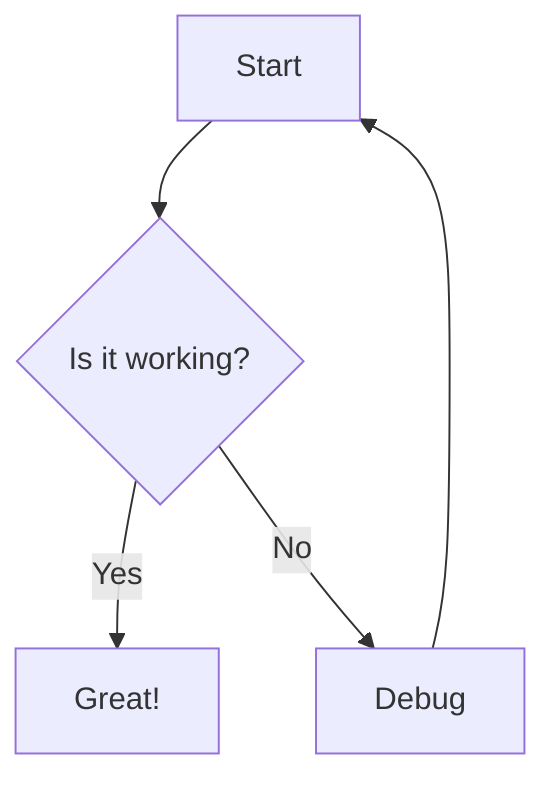
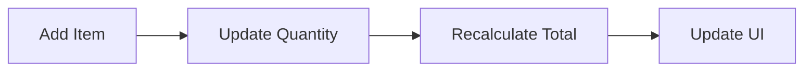

# Explicode Skill

Explicode embeds rich **Markdown documentation** inside code comments, making a single source
file serve as both runnable code and clean, readable documentation. Your job is to write or
annotate code so that Explicode will render it beautifully.

---

## Core Concept

Explicode alternates between two kinds of blocks:

1. **Doc blocks** — multiline comments written in Markdown. Rendered as formatted documentation.
2. **Code blocks** — everything outside doc blocks. Rendered as syntax-highlighted code.

The goal is a narrative flow: documentation explains *why* and *what*, code shows *how*.

---

## Comment Syntax by Language

### Python
Use triple-quoted strings (`"""` or `'''`) that start **at the beginning of a line** (only
leading whitespace allowed before them). Mid-expression triple-quotes are ignored.

```python
"""
# Module Title

This is a **doc block** rendered as Markdown.
"""

"""
## my_func

Explain what this function does, its parameters, and return value.
"""

def my_func():
    pass

x = """NOT a doc block — assigned to a variable"""
```

### JavaScript / TypeScript / JSX / TSX / Java / C / C++ / C# / Go / Rust / PHP / Swift / Kotlin / Scala / Dart / Objective-C / SQL
Use `/* ... */` block comments. JSDoc-style `/** ... */` also works — leading asterisks are
stripped automatically.

```javascript
/*
# Module Title

This is a **doc block**.
*/

/**
 * ## myFunction
 *
 * JSDoc-style also works — asterisks are stripped.
 *
 * @param {number} n - Description
 * @returns {number[]} Description
 */
function myFunction(n) { ... }

// Single-line comments are NOT doc blocks — they stay as code.
```

---

## How to Structure Explicode Files

### General Principles

- **Open with a top-level doc block** introducing the module, file purpose, and any high-level
  context. Use a `#` heading.
- **Place a doc block immediately before each major section, class, or function** that needs
  explanation. The doc block comes before the `def`, `function`, `class`, etc. — never inside
  the function body.
- **Keep doc blocks focused**: explain *intent*, *inputs/outputs*, *edge cases*, *algorithms*,
  *usage examples*. Don't repeat what the code already says literally.
- **Let code speak for itself** for trivial lines. Don't over-comment simple assignments.
- **Use Markdown freely**: headings, bold, italic, lists, tables, math, code snippets, diagrams.

### Structure Pattern

```
[Module-level doc block]
[imports / top-level code]

[Section doc block — if file has major sections]
[section code]

[Function/class doc block]
[function/class definition]

[Another doc block]
[more code]
...
```

### Doc Block Contents — What to Include

| Element | Include when |
|---|---|
| `#` / `##` heading | Always — for module and major functions |
| Purpose paragraph | Always |
| Parameters & return | For all non-trivial functions |
| Usage example | For public APIs, complex functions |
| Algorithm explanation | For non-obvious logic |
| Edge cases / caveats | Whenever relevant |
| Math (`$...$`) | For formulas or complexity |
| Mermaid diagram | For flows, state machines, architectures |
| Links | To related files or external docs |

---

## Markdown Features Available

Full [CommonMark](https://www.markdownguide.org/basic-syntax/) syntax is supported inside doc
blocks, including all the features below.

---

### Media

Supported file types: `png`, `jpg`, `jpeg`, `gif`, `svg`, `webp`. Use external URLs or relative
paths — relative paths resolve from the current file's location.

```markdown


```

---

### Links

Repository files can be interlinked using relative paths. External URLs open in a new browser tab.

```markdown
[Same folder](app.py)
[Subfolder](src/app.py)
[Parent folder](../README.md)
[External](https://explicode.com)
```

To link to a specific heading in another file, use `#` followed by the heading title in
lowercase with spaces replaced by hyphens and special characters removed.

```markdown
[Link to heading](./src/app.py#how-to-test-code)
[Same page heading](#how-to-test-code)
```

---

### Math (KaTeX)

Inline math uses single dollar signs, block math uses double dollar signs or a fenced code
block with the `math` language tag.

~~~markdown
Inline: $E = mc^2$

Block:
$$
\frac{d}{dx}\left(\int_{a}^{x} f(t)\,dt\right) = f(x)
$$

or

```math
\frac{d}{dx}\left(\int_{a}^{x} f(t)\,dt\right) = f(x)
```
~~~

---

### Diagrams (Mermaid)

Use a fenced code block with the `mermaid` language tag to render diagrams.

~~~markdown

~~~

---

## Quality Standards

When writing Explicode-style code, aim for:

1. **A reader unfamiliar with the codebase should understand the file** by reading only the doc
   blocks (skipping the code).
2. **A developer reading the code** should find doc blocks that add context, not just restate
   what the code says.
3. **Doc blocks and code alternate naturally** — avoid long stretches of code with no
   documentation, and avoid excessive documentation of trivial lines.
4. **Headings create hierarchy**: `#` for the file, `##` for major sections/classes,
   `###` for functions/methods.

---

## Examples

### Python Example

~~~python
"""
# User Authentication Module

Handles password hashing, token generation, and session validation.

> **Security note**: Passwords are never stored in plaintext.
> Uses bcrypt with a cost factor of 12.
"""

import bcrypt
import secrets
from datetime import datetime, timedelta

"""
## hash_password

Hashes a plaintext password using bcrypt.

- **Input**: `password` (str) — the user's plaintext password
- **Output**: bytes — the bcrypt hash, safe to store in the database
"""

def hash_password(password: str) -> bytes:
    return bcrypt.hashpw(password.encode(), bcrypt.gensalt(rounds=12))

"""
## verify_password

Checks a plaintext password against a stored bcrypt hash.

Returns `True` if they match, `False` otherwise. Timing-safe.
"""

def verify_password(password: str, hashed: bytes) -> bool:
    return bcrypt.checkpw(password.encode(), hashed)
~~~

### JavaScript Example

~~~javascript
/*
# Shopping Cart

Manages items, quantities, and total calculation for the checkout flow.


*/

/*
## CartItem

Represents a single product in the cart.

| Field | Type | Description |
|-------|------|-------------|
| id | string | Product ID |
| name | string | Display name |
| price | number | Unit price in USD |
| qty | number | Quantity selected |
*/

class CartItem {
    constructor(id, name, price, qty = 1) {
        this.id = id;
        this.name = name;
        this.price = price;
        this.qty = qty;
    }
}

/*
## Cart.total

Calculates the subtotal across all items.

$$
\text{total} = \sum_{i=1}^{n} \text{price}_i \times \text{qty}_i
$$
*/

get total() {
    return this.items.reduce((sum, item) => sum + item.price * item.qty, 0);
}
~~~

---

## When Adding Documentation to Existing Code

1. **Read the full file first** to understand its structure and purpose.
2. **Identify doc block insertion points**: top of file, before each class, before each
   significant function, before complex logic blocks.
3. **Write the module-level doc block first** with a title and overview.
4. **Work top to bottom**, inserting doc blocks at each insertion point.
5. **Don't modify the code itself** unless asked — only add comments.
6. **Match the file's language** to use the correct comment syntax.